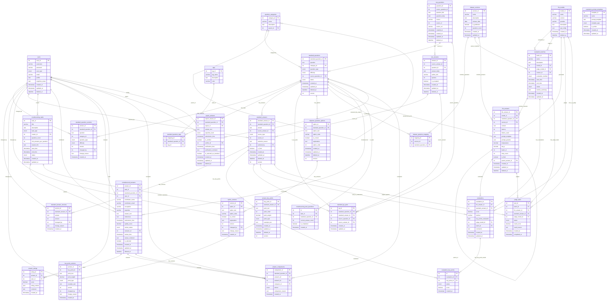

```mermaid
erDiagram
    users {
        int user_id PK
        varchar username
        varchar password
        enum user_type
        varchar email
        text profile
        text expertise_areas
        timestamp created_at
        timestamp updated_at
        datetime deleted_at
    }
    
    raw_questions {
        int question_id PK
        int source_question_id
        text question_title
        text question_body
        varchar source
        int source_id
        varchar source_url
        timestamp crawled_at
        timestamp created_at
        timestamp updated_at
        datetime deleted_at
    }
    
    raw_answers {
        int answer_id PK
        int source_answer_id
        int question_id FK
        text answer_body
        varchar author_info
        int upvotes
        boolean is_accepted
        timestamp created_at
        timestamp updated_at
        datetime deleted_at
    }
    
    question_categories {
        int category_id PK
        varchar name
        text description
        int parent_id FK
    }
    
    tags {
        int tag_id PK
        varchar tag_name
        text description
        varchar color
    }
    
    standard_questions {
        int standard_question_id PK
        text question
        int category_id FK
        enum question_type
        enum difficulty
        int source_question_id FK
        enum status
        timestamp created_at
        timestamp updated_at
        datetime deleted_at
        int version
    }
    
    standard_question_versions {
        int version_id PK
        int standard_question_id FK
        text question
        int category_id
        enum question_type
        enum difficulty
        int version
        int changed_by FK
        text change_reason
        timestamp created_at
    }
    
    standard_question_tags {
        int mapping_id PK
        int standard_question_id FK
        int tag_id FK
    }
    
    standard_answers {
        int standard_answer_id PK
        int standard_question_id FK
        text answer
        int source_answer_id FK
        enum source_type
        int source_id
        text selection_reason
        int selected_by FK
        boolean is_final
        timestamp created_at
        timestamp updated_at
        datetime deleted_at
        int version
    }
    
    standard_answer_versions {
        int version_id PK
        int standard_answer_id FK
        text answer
        int version
        int changed_by FK
        text change_reason
        timestamp created_at
    }
    
    answer_key_points {
        int key_point_id PK
        int standard_answer_id FK
        text point_text
        int point_order
        decimal point_weight
        enum point_type
        text example_text
        timestamp created_at
        timestamp updated_at
        datetime deleted_at
        int version
    }
    
    key_point_versions {
        int version_id PK
        int key_point_id FK
        text point_text
        decimal point_weight
        enum point_type
        text example_text
        int version
        int changed_by FK
        text change_reason
        timestamp created_at
    }
    
    objective_question_options {
        int option_id PK
        int standard_question_id FK
        text option_text
        varchar option_code
        boolean is_correct
        text explanation
        int option_order
        timestamp created_at
        timestamp updated_at
        datetime deleted_at
        int version
    }
    
    option_versions {
        int version_id PK
        int option_id FK
        text option_text
        varchar option_code
        boolean is_correct
        text explanation
        int version
        int changed_by FK
        text change_reason
        timestamp created_at
    }
    
    standard_qa_pairs {
        int qa_id PK
        int standard_question_id FK
        int standard_answer_id FK
        int source_question_id FK
        int source_answer_id FK
        timestamp created_at
        timestamp updated_at
    }
    
    dataset_versions {
        int version_id PK
        varchar name
        text description
        date release_date
        boolean is_published
        int question_count
        timestamp created_at
        timestamp updated_at
    }
    
    dataset_question_mapping {
        int mapping_id PK
        int version_id FK
        int standard_question_id FK
    }
    
    llm_models {
        int model_id PK
        varchar name
        varchar version
        varchar provider
        text description
        json api_config
        timestamp created_at
        datetime deleted_at
    }
    
    evaluation_batches {
        int batch_id PK
        varchar name
        text description
        int model_id FK
        int judge_model_id FK
        int version_id FK
        enum evaluation_method
        timestamp start_time
        timestamp end_time
        enum status
        json metrics_summary
        timestamp created_at
        timestamp updated_at
    }
    
    llm_answers {
        int llm_answer_id PK
        int model_id FK
        int standard_question_id FK
        int version_id FK
        text content
        int latency
        int tokens_used
        text prompt_template
        json prompt_params
        decimal temperature
        decimal top_p
        int batch_id FK
        int retry_count
        boolean is_final
        int parent_answer_id FK
        timestamp created_at
        timestamp updated_at
        datetime deleted_at
    }
    
    evaluations {
        int evaluation_id PK
        int llm_answer_id FK
        int standard_answer_id FK
        decimal score
        varchar method
        json key_points_evaluation
        int judge_model_id FK
        int batch_id FK
        text comments
        timestamp created_at
        timestamp updated_at
    }
    
    evaluation_key_points {
        int id PK
        int evaluation_id FK
        int key_point_id FK
        enum status
        decimal score
        timestamp created_at
    }
    
    evaluation_prompt_templates {
        int template_id PK
        varchar name
        text prompt_template
        enum template_type
        boolean is_active
        timestamp created_at
        timestamp updated_at
    }
    
    judge_tasks {
        int task_id PK
        int batch_id FK
        int llm_answer_id FK
        int standard_answer_id FK
        int judge_model_id FK
        enum status
        decimal result_score
        text result_reason
        timestamp created_at
        timestamp completed_at
    }
    
    crowdsourcing_tasks {
        int task_id PK
        varchar title
        text description
        enum task_type
        int creator_id FK
        int question_count
        int min_answers_per_question
        text reward_info
        timestamp start_time
        timestamp end_time
        enum status
        timestamp created_at
        timestamp updated_at
    }
    
    crowdsourced_answers {
        int answer_id PK
        int task_id FK
        int standard_question_id FK
        int user_id FK
        varchar contributor_name
        varchar contributor_email
        varchar occupation
        varchar expertise
        text answer_text
        text references
        timestamp submission_time
        decimal quality_score
        enum review_status
        int reviewer_id FK
        timestamp review_time
        text review_comment
        boolean is_selected
        timestamp created_at
        timestamp updated_at
        datetime deleted_at
    }
    
    crowdsourcing_task_questions {
        int id PK
        int task_id FK
        int standard_question_id FK
        int current_answer_count
        boolean is_completed
        timestamp created_at
    }
    
    answer_ratings {
        int rating_id PK
        int answer_id FK
        int rater_id FK
        decimal score
        json rating_criteria
        text comment
        timestamp created_at
    }
    
    answer_comparisons {
        int comparison_id PK
        int standard_question_id FK
        int answer1_id FK
        int answer2_id FK
        int comparer_id FK
        enum winner
        text comparison_reason
        timestamp created_at
    }
    
    expert_answers {
        int expert_answer_id PK
        int standard_question_id FK
        int expert_id FK
        text answer_text
        enum expertise_level
        timestamp submission_time
        boolean is_verified
        int verifier_id FK
        timestamp verification_time
        text verification_comment
        boolean is_selected_as_standard
        timestamp created_at
        timestamp updated_at
        datetime deleted_at
    }

    users ||--o{ standard_question_versions : "changed_by"
    users ||--o{ standard_answer_versions : "changed_by"
    users ||--o{ key_point_versions : "changed_by"
    users ||--o{ option_versions : "changed_by"
    users ||--o{ standard_answers : "selected_by"
    users ||--o{ crowdsourcing_tasks : "creator"
    users ||--o{ crowdsourced_answers : "contributor"
    users ||--o{ crowdsourced_answers : "reviewer"
    users ||--o{ answer_ratings : "rater"
    users ||--o{ answer_comparisons : "comparer"
    users ||--o{ expert_answers : "expert"
    users ||--o{ expert_answers : "verifier"
    
    raw_questions ||--o{ raw_answers : "has"
    raw_questions ||--o{ standard_questions : "source_of"
    raw_questions ||--o{ standard_qa_pairs : "source_question"
    
    raw_answers ||--o{ standard_answers : "source_of"
    raw_answers ||--o{ standard_qa_pairs : "source_answer"
    
    question_categories ||--o{ standard_questions : "categorizes"
    question_categories ||--o{ question_categories : "parent_of"
    
    tags ||--o{ standard_question_tags : "used_in"
    
    standard_questions ||--o{ standard_question_versions : "has_versions"
    standard_questions ||--o{ standard_question_tags : "has_tags"
    standard_questions ||--o{ standard_answers : "has_answers"
    standard_questions ||--o{ standard_qa_pairs : "in_qa_pairs"
    standard_questions ||--o{ objective_question_options : "has_options"
    standard_questions ||--o{ dataset_question_mapping : "in_datasets"
    standard_questions ||--o{ llm_answers : "answered_by_llm"
    standard_questions ||--o{ crowdsourced_answers : "crowdsourced"
    standard_questions ||--o{ crowdsourcing_task_questions : "in_tasks"
    standard_questions ||--o{ answer_comparisons : "compared"
    standard_questions ||--o{ expert_answers : "answered_by_expert"
    
    standard_answers ||--o{ standard_answer_versions : "has_versions"
    standard_answers ||--o{ answer_key_points : "has_key_points"
    standard_answers ||--o{ standard_qa_pairs : "in_qa_pairs"
    standard_answers ||--o{ evaluations : "used_in_evaluations"
    standard_answers ||--o{ judge_tasks : "judged_against"
    
    answer_key_points ||--o{ key_point_versions : "has_versions"
    answer_key_points ||--o{ evaluation_key_points : "evaluated"
    
    objective_question_options ||--o{ option_versions : "has_versions"
    
    dataset_versions ||--o{ dataset_question_mapping : "contains_questions"
    dataset_versions ||--o{ evaluation_batches : "used_in_batches"
    dataset_versions ||--o{ llm_answers : "contains_answers"
    
    llm_models ||--o{ evaluation_batches : "evaluated_in"
    llm_models ||--o{ evaluation_batches : "judge_in"
    llm_models ||--o{ llm_answers : "generated"
    llm_models ||--o{ evaluations : "judges"
    llm_models ||--o{ judge_tasks : "acts_as_judge"
    
    evaluation_batches ||--o{ llm_answers : "contains_answers"
    evaluation_batches ||--o{ evaluations : "has_evaluations"
    evaluation_batches ||--o{ judge_tasks : "has_judge_tasks"
    
    llm_answers ||--o{ llm_answers : "parent_of"
    llm_answers ||--o{ evaluations : "evaluated"
    llm_answers ||--o{ judge_tasks : "judged"
    
    evaluations ||--o{ evaluation_key_points : "has_key_point_results"
    
    crowdsourcing_tasks ||--o{ crowdsourced_answers : "collects"
    crowdsourcing_tasks ||--o{ crowdsourcing_task_questions : "contains_questions"
    
    crowdsourced_answers ||--o{ answer_ratings : "rated"
    crowdsourced_answers ||--o{ answer_comparisons : "answer1"
    crowdsourced_answers ||--o{ answer_comparisons : "answer2"
```

